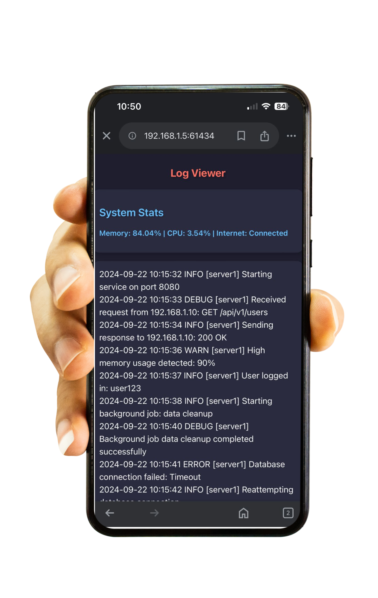

# LogBeam

`LogBeam` is a lightweight, efficient tool for quickly sharing console output or log files across devices, especially useful for viewing on mobile devices.



## Usage

```
git clone https://github.com/avneesh99/LogBeam
go mod tidy
go build -o LogBeam
<any command> | ./LogBeam
```

This will start a local server and display a QR code. Scan the QR code with your phone to view the output in real-time (make sure the PC and mobile are on the same network)

## Features

- **Instant Sharing**: Pipe any command output or log file directly to `LogBeam` for immediate viewing on other devices.
- **QR Code Access**: Easily connect to the shared content by scanning a QR code.
- **Real-time Updates**: View console output as it happens, great for monitoring long-running processes.
- **System Metrics**: Check CPU usage, memory consumption, and internet connectivity status alongside your logs.
- **Efficient Resource Usage**: Designed to be lightweight and consume minimal system resources.

## Why Use LogBeam?

1. **Convenience**: Quickly view logs or command output on your phone without setting up complex remote access.
2. **Debugging on the Go**: Monitor processes or debug issues from your mobile device when you're away from your desk.
3. **No Additional Software**: Uses your phone's built-in web browser - no need for special apps or tools.
4. **Privacy**: Your data stays on your local network, never passing through external servers.

## Technical Highlights

- **Concurrent Design**: Utilizes Go's goroutines for efficient handling of multiple connections.
- **Context-based Cancellation**: Implements context for graceful shutdown and request cancellation.
- **Race Condition Prevention**: Careful use of mutexes and atomic operations to prevent data races.
- **Efficient File Handling**: Uses buffered I/O for optimal performance when reading large files.
- **Graceful Shutdown**: Properly closes connections and resources when the server is stopped.

## How It Works

1. The tool starts a local HTTP server on a random available port.
2. It generates a QR code containing the URL to access the shared content.
3. When accessed, it streams the piped input in real-time to connected clients.
4. System stats are periodically updated and can be fetched via an API endpoint.

## Contributing

Contributions are welcome! Please feel free to submit a Pull Request.

## License

This project is licensed under the MIT License - see the [LICENSE](LICENSE) file for details.